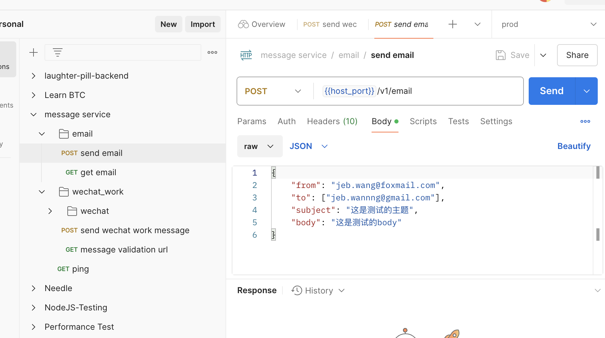
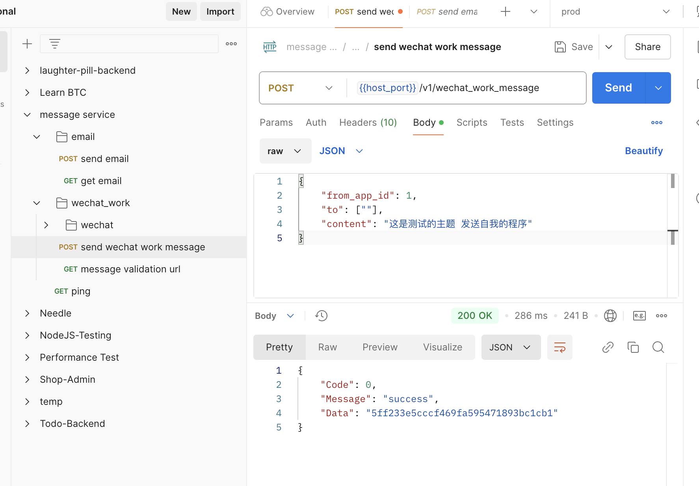
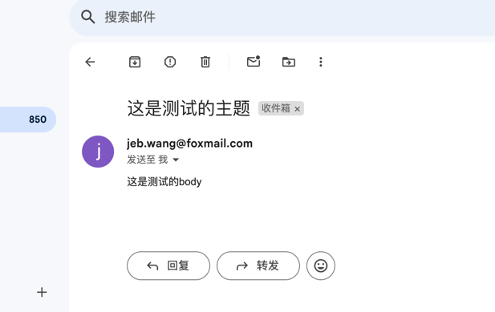
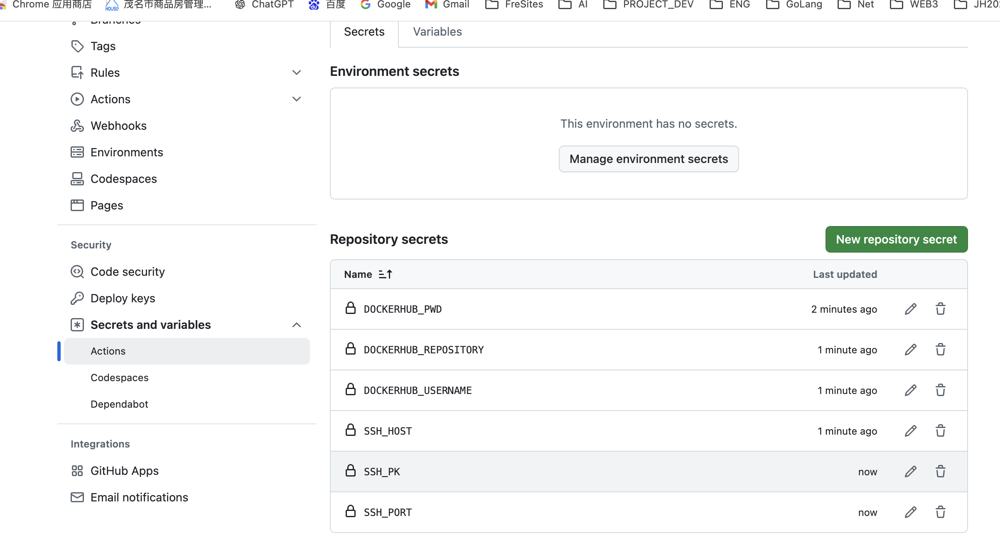

# message-service
## 这是什么
一个用来发送聚合消息的服务，run起来后，就可以调这个服务提供的接口来发送消息，目前只支持发送邮件以及企业微信消息

## 为什么要开发这个项目
我自己的vps上跑了很多服务，如抢优惠券，链上套利等，很多重要事件都要即时通知到我这边。
比如抢到了很重要的券，套利成功了多少钱，亏了多少钱等。之前用的是发邮件的方式做消息通知，
缺点太多了，Java写的逻辑换到go服务上又要写一遍，还有我邮件经常漏看。

所以就有了这个项目，一来使用方直接http请求就能发消息，不需要关心业务服务使用了啥语言，
二来消息可以直接通过企业微信的应用，直接发送到我的微信上面，就像普通朋友给我发消息一样，即时性很高。

## 谁适合使用这个项目
1. 像我一样，上线了很多线上服务，实现语言都不同，这些服务都需要发送邮件及微信消息，然后又懒得去改现有代码，针对每种语言都做一套实现
2. 不想从头开始开发，拿一个代码过来改改就能用

## 如何使用这个仓库
1. 前置条件： 
   - 根据这个[文档](docs/企业微信开发.md)拿到企业微信开发相关的信息，包括company_id, company_secret, agent_id, msg_receiving_server_token, msg_receiving_server_aeskey
   - 网上搜一下，拿到你需要用来发送邮件的邮箱的smtp username及smtp password
2. 把第一步拿到的信息填入sql/ddl.sql中，执行sql
3. 配置你的数据库，configs/application.yaml
4. 配置你的http request token: configs/application.yaml -> business->owner_token, 请求接口时，需要请求头带上这个header 
5. 把cmd/main.go run起来
6. postman 调/v1/email来异步发送邮件或者/v1/wechat_work_message来发送企业微信消息

怎么上到生产环境：
1. 项目已经配置了github action，然后还用到了docker hub的仓库，所以需要在你自己的github仓库上配置这两个信息，请查看.github/workflows/cicd_prod.yaml的注释
2. 完了之后你推个commit到master就会触发自动构建，自动部署上服务器了

## 成功的例子

